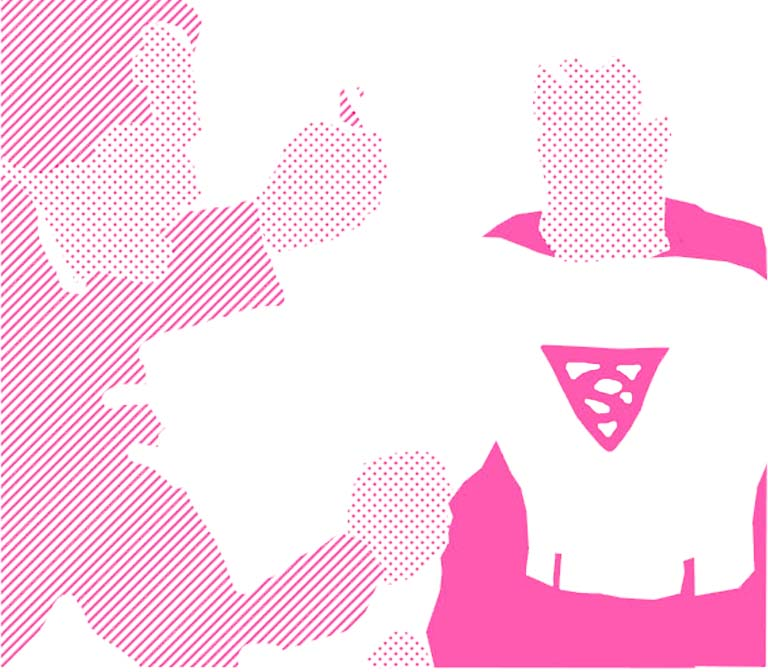
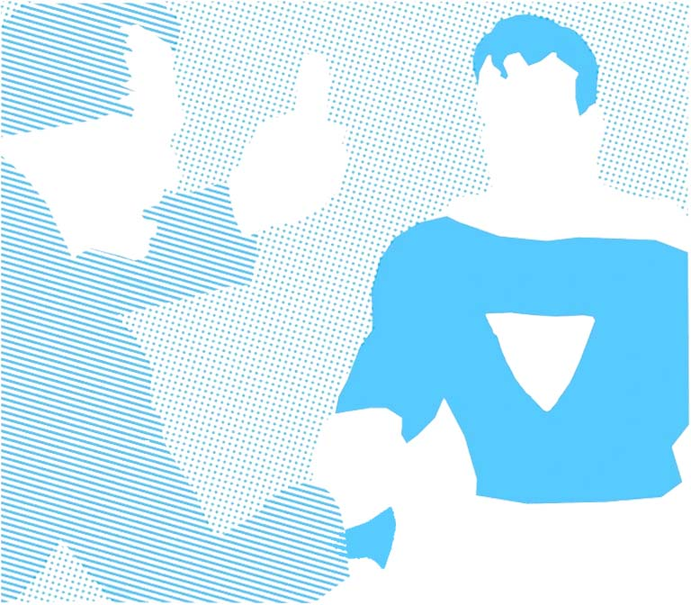
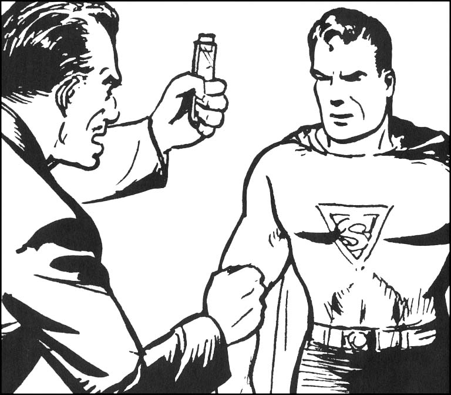
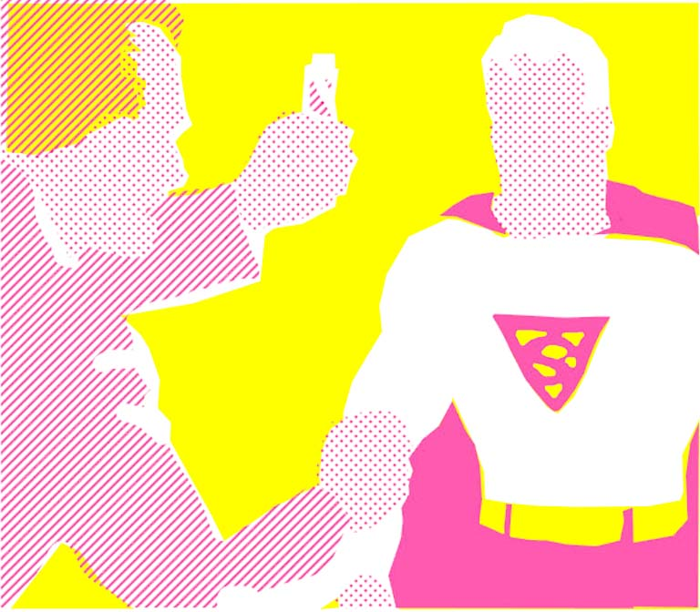
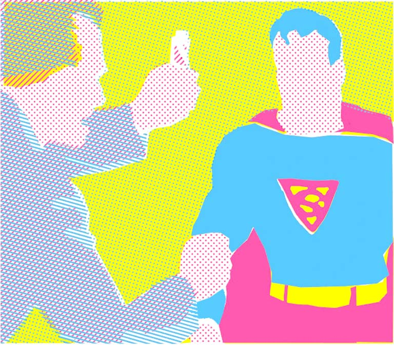
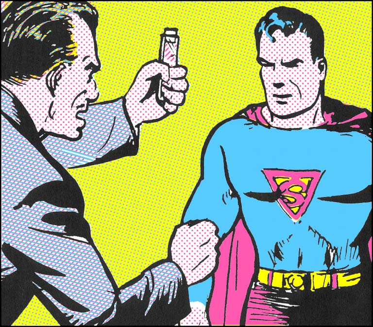

# Ben-Day-Dots-Shading
My attempt to achieve ben-day dots effect in comic book.

|  | Yellow | Magenta | Cyan | Black |
| --- | --- | --- | --- | --- |
| Single |  |  |  |  |
|Addtive |  |  |  |  |

## TODOs
- [x] [Paper texture](shaders/paper.glsl)

- [ ] CMYK
- [ ] CNYK With dots
- [ ] Edges 

## References
1. [BEN DAY DOTS Series](https://legionofandy.com/2013/06/03/roy-lichtenstein-the-man-who-didnt-paint-benday-dots/)