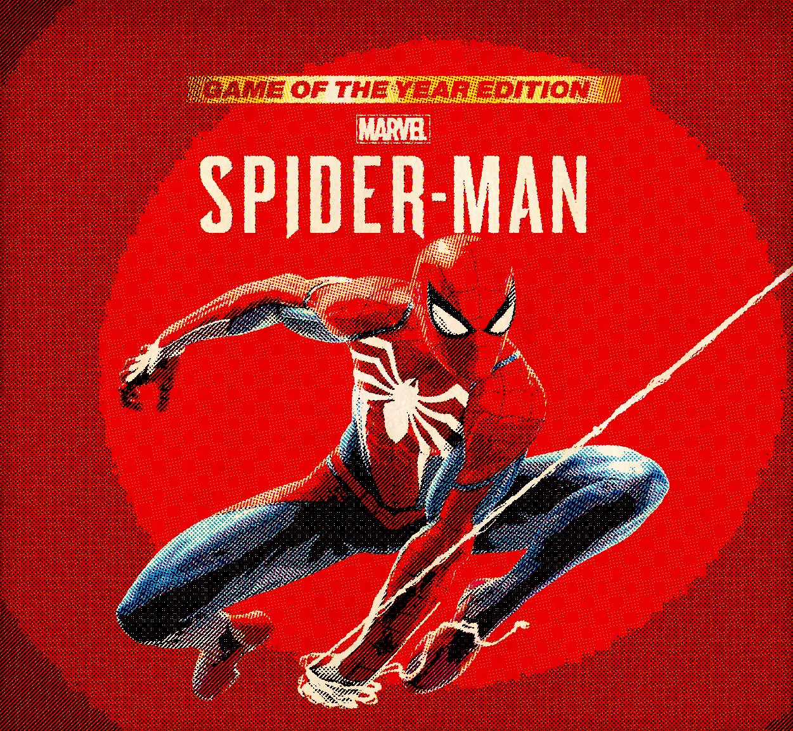
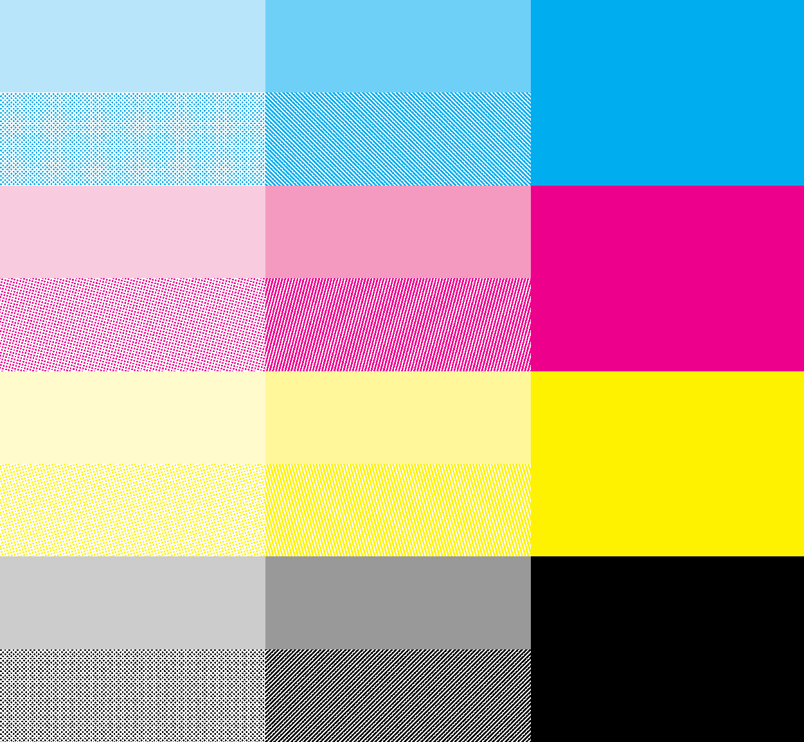

# Ben-Day-Dots-Shading
My attempt to achieve ben-day dots effect in comic book.

|  | Yellow | Magenta | Cyan | Black |
| :---: | :---: | :---: | :---: | :---: |
| Single |  |  |  |  |
| Progressive |  |  |  |  |

## Features
### [Paper texture](shaders/paper.glsl)

| Before | After |
| :---: | :---: |
|  |  |

### [Flat shading](shaders/separate.glsl)

| Before | After |
| :---: | :---: |
|  |  |

-  Color separation:

| | Yellow | Magenta | Cyan | Black |
| :---: | :---: | :---: | :---: | :---: |
| Single |  |  |  |  |
| Progressive |  |  |  |  |

### [Ben-Day dots](shaders/screen.glsl)

- [Composition](shaders/composite.glsl)

| Before | After |
| :---: | :---: |
|   | |

## TODOs
- [] Polish thoughts
  - better flat shading
  - adjust dot size and space

## References
1. [BEN DAY DOTS Series](https://legionofandy.com/2013/06/03/roy-lichtenstein-the-man-who-didnt-paint-benday-dots/)