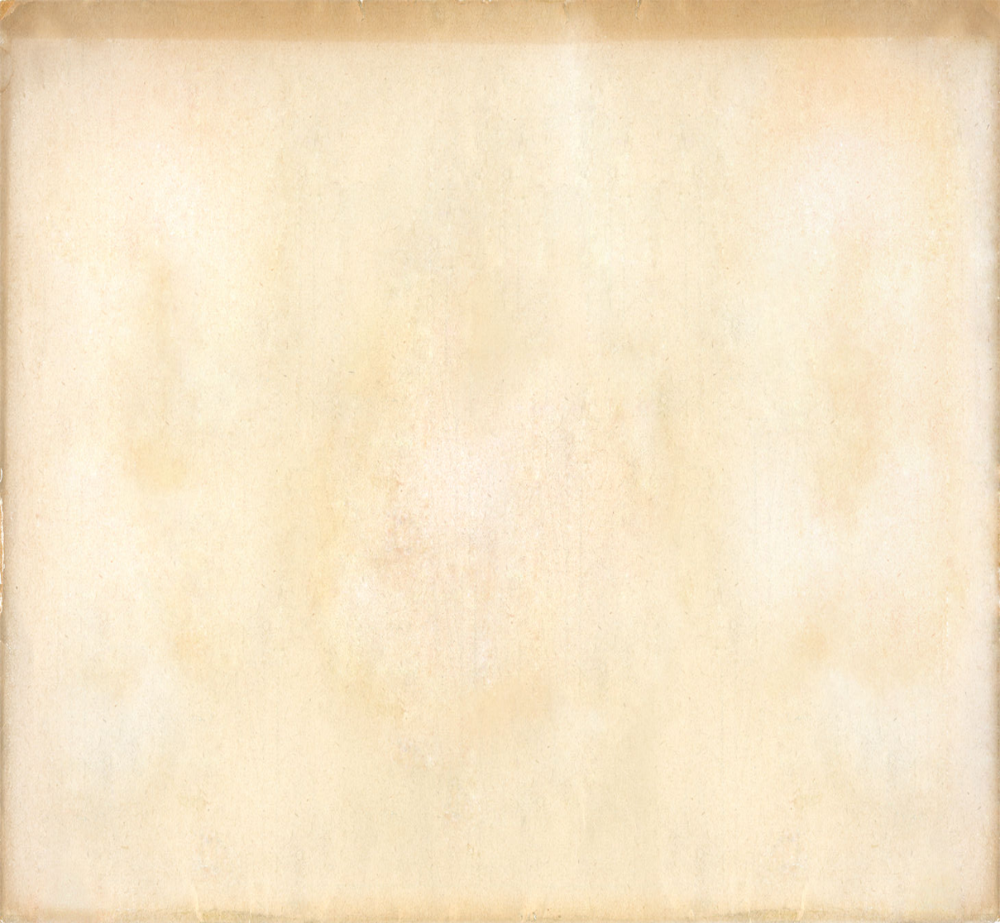
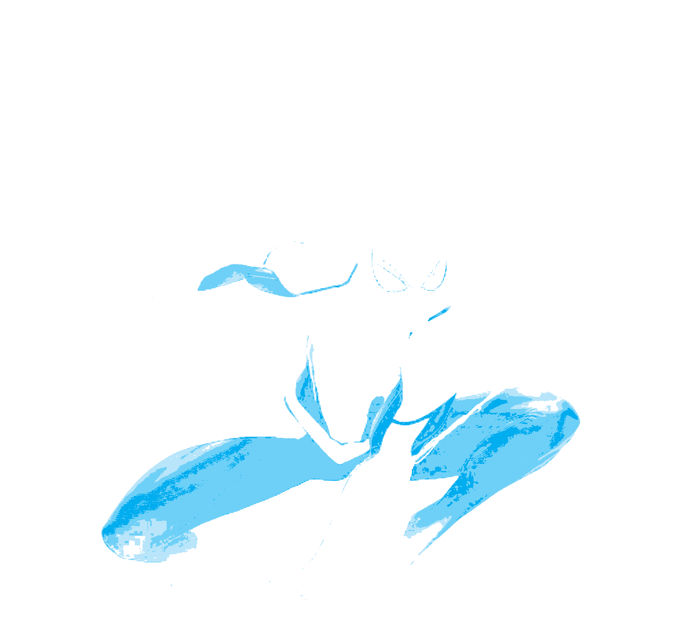
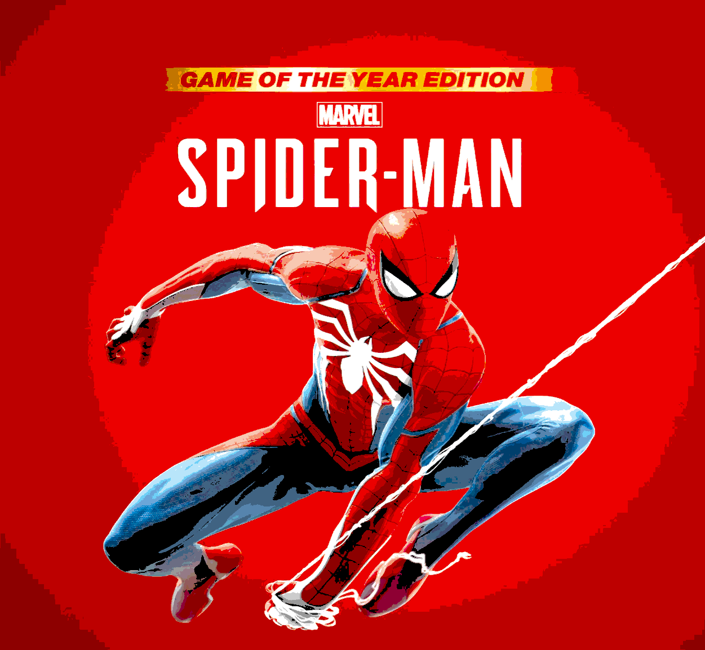
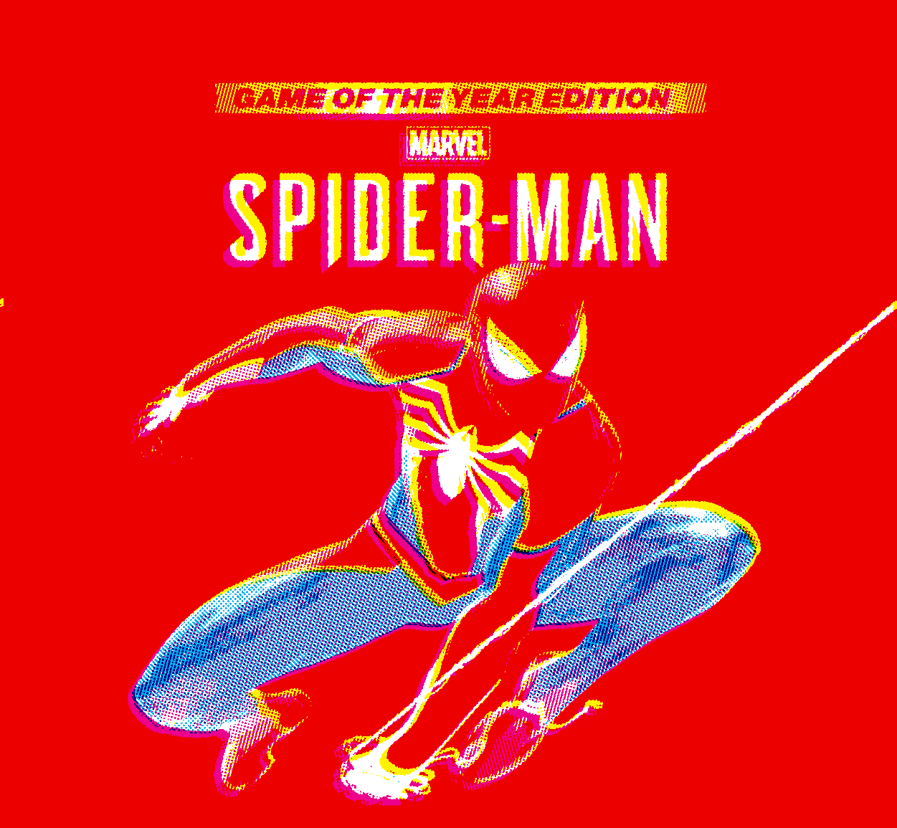
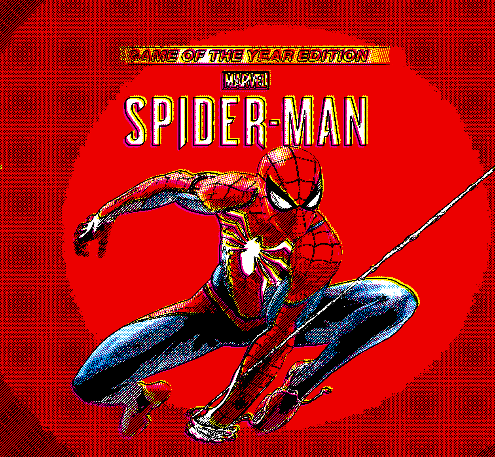
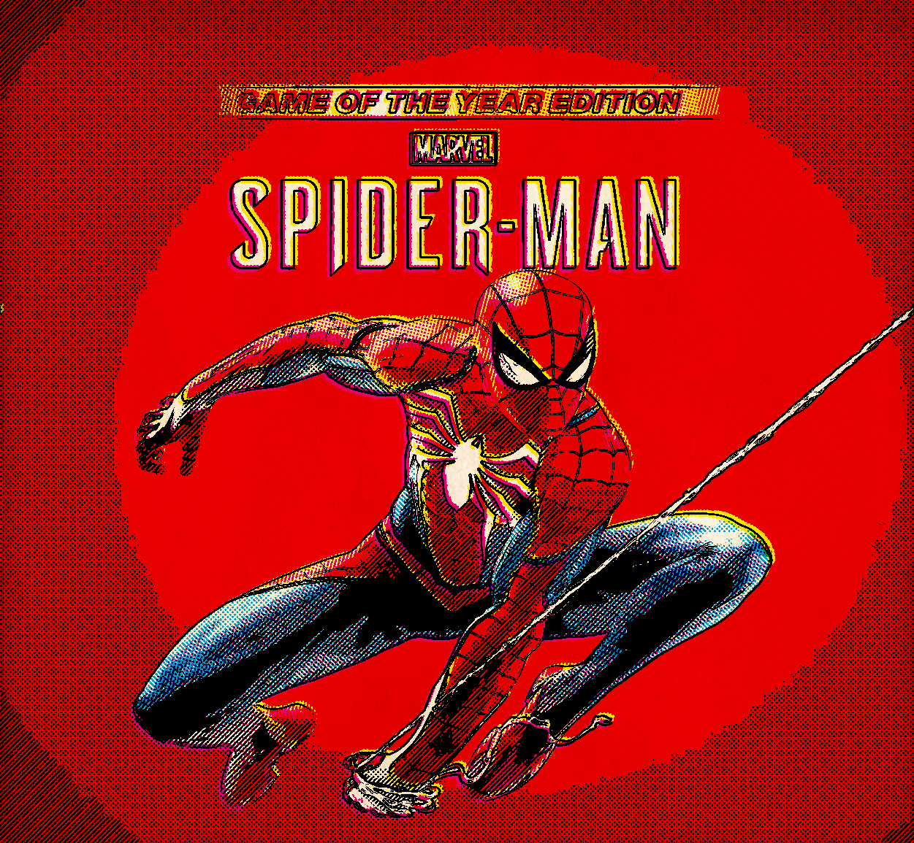

# Ben-Day-Dots-Shading

## Introduction

I come across a series of great articles written by [Legion of Andy](https://legionofandy.com/) describing the history of [Ben Day Dots](https://en.wikipedia.org/wiki/Ben_Day_process), where it was first invented by [Benjamin Henry Day Jr](https://en.wikipedia.org/wiki/Benjamin_Henry_Day_Jr.) and used as a cheap and efficient way to print colors in the newspapers and comic books in the 20th century. I find the effect has aesthetic and nostalgic value, especially after watching movies like [*Spider-Man: Into the Spider-Verse*](https://www.sonypictures.com/movies/spidermanintothespiderverse) and shorts like [*Just A Thought*](https://www.disneyanimation.com/shortcircuit/just-a-thought/), so I decided to write an image filter to achieve similar style using fragment shaders, this is done over a weekend.

||
|:---:|
|*(Image credit: © [Legion of Andy](https://legionofandy.com/))*|

The following diagram is a color experiment introduced in [Legion of Andy](](https://legionofandy.com/2016/08/26/ben-day-dots-part-8-1930s-to-1950s-the-golden-age-of-comics/))'s blog. In the old days, artists will need to come up with 4 versions of the painting to print it in color, one color for each version, i.e., yellow, magenta, cyan, and black. If we print them onto the paper in this order, we will get a color painting. The first row is what each version looks like, the second row shows the progressive result that we would expect.

|  | Yellow | Magenta | Cyan | Black | Print on paper |
| :---: | :---: | :---: | :---: | :---: | :---: |
| Separated |  |  |  |  |  |
| Progressive |  |  |  |  |  |

With only 4 colors (cyan, magenta, yellow, and black, [CMYK](https://en.wikipedia.org/wiki/CMYK_color_model) for short), however, one could only achieve a total of 7 colors (3 primaries, 3 secondaries, and black).

||
|:---:|
|*(Image credit: © [Wikipedia](https://en.wikipedia.org/wiki/CMYK_color_model))*|

Here is where the magic of Ben Day Dots comes in, by printing patterns of various sizes and spacings of dots, artists could control the shade of the color, thus creating more variation. Later I will create the light shade (about 25%) with dots, dark shade (about 50%) with lines, and solid shade (100%) for each primary color and black.

|  ||
|:---:| :---: |
|*(Image credit: © [Legion of Andy](https://legionofandy.com/))*|*(Image credit: © [Legion of Andy](https://legionofandy.com/))*|

## Implementation

### Flat Shade

First, I pick an image (from [PlayStation](https://www.playstation.com/en-us/games/marvels-spider-man/) website) as the original to work with.

||
|:---:|
|*(Image credit: © [PlayStation](https://www.playstation.com/en-us/games/marvels-spider-man/))*|

To shade it with Ben Day Dots later, one need to decide which part of the image need to be included for each color pass, thus the first step of the program need to separate the CMYK components of the image, which I call [color separation](shaders/separate.glsl). The basic idea is to convert the color from RGB space to CMYK space, then based on the value of each channel, we divide the continuous value into 3 discrete shades (light, dark, and solid). 

| | Yellow | Magenta | Cyan | Black | Outline |
| :---: | :---: | :---: | :---: | :---: | :---: |
| Separated |  |  |  |  |  |
| Progressive |  |  |  |  |  |

For black, in particular, I added the option to include [outline](shaders/outline.glsl) into the shading, which is computed using central differences.

The results is shown below:

| Original | Flat Shade | With Outline |
| :---: | :---: | :---: |
|  |  |   |

### Misregistration

One more step before the dots, by far each pass are in perfect alignment. In most comic books, however, different passes weren't always perfectly align with each other, due to misalignment of the printing machine or human mistakes. But it's the way it is, normally, we would treat an alignment with slightly offset as perfect alignment, for example, focus on the hair of the man in the following picture, the yellow shade and magenta are slightly off, but it still looks awesome! 

||
|:---:|
|*(Image credit: © [Legion of Andy](https://legionofandy.com/))*|*(Image credit: © [Legion of Andy](https://legionofandy.com/))*|

Thus, by offsetting the UV for each passes, in my case, keeping cyan and black fixed, moving yellow and magenta along the diagonal in the opposite direction, we now have "perfect" alignment:

| Original | Flat Shade with Outline | Misregistration |
| :---: | :---: | :---: |
|  |  |   |

### Shade with Ben-Day Dots

By vertically and horizontally repeating dots (small circles) on canvas and varying their spacing we can approximate the [shade (called screen)](shaders/screen.glsl) that we want:

||
|:---:|
| *Color Board: actual shade followed by approximate shade using dots for each color, 3 shades for each* |

Without enforcing anti-aliasing, the dots we draw actaully looks like the dots printed on the newspaper in the old days because they are not perfect! However, to avoid generating unwanted effects (moire patterns), there are some [standards](http://the-print-guide.blogspot.co.uk/2009/05/halftone-screen-angles.html) such as the one below that we can follow to rotate the screen:

||
|:---:|
|*(Image credit: © [Legion of Andy](https://legionofandy.com/))*|*(Image credit: © [Legion of Andy](https://legionofandy.com/))*|

But most of the examples from real comics used the following angles, so I use these instead.
- Cyan - 135 degrees
- Yellow - 105 degrees
- Magenta - 75 degrees
- Black - 45 degrees

Without further ado, by replacing the flat shade we created before with approximate shade using dots:

| | Yellow | Magenta | Cyan | Black + Outline |
| :---: | :---: | :---: | :---: | :---: |
| Flat shade |  |  |  |  |
| Ben Day Dots |  |  |  |  |

And [compositing](shaders/composite.glsl) them together with the [paper](shaders/paper.glsl) texture, we have our comic effect:

| Original | Ben Day Dots | With Outline |
| :---: | :---: | :---: |
|  |  |   |

## TODOs
- [x] Polish thoughts
  - [x] better flat shading
  - [x] adjust dot size and space
  - [x] grey shade
  - [x] appropriate screen angles
  - [x] misregistration
  - [x] yellow is too bright
- [ ] Write-up

## Conclusion

I recently started to play with [shadertoy](https://www.shadertoy.com/), so this is my first attempt to shade something using only fragment shaders. It's very fun, and I find it satisfying to replace `if-else` statement with `mix` and `step` functions in the process. I would like to thank [Legion of Andy](https://legionofandy.com/) for his articles describing the technique in great length, he proves once again art and technology always find a way to work together and influence one another, which is why I love graphics programming so much. Till next project :)

||
|:---:|
|*(Image credit: © Marvel)*|

## References
- [BEN DAY DOTS Series](https://legionofandy.com/2013/06/03/roy-lichtenstein-the-man-who-didnt-paint-benday-dots/): A series of wonderful articles by [Legion of Andy](https://legionofandy.com/) introducing the history and usage of Ben Day Dots.
- [Shadertoy Tutorial Series](https://inspirnathan.com/posts/47-shadertoy-tutorial-part-1): A great tutorial by [Nathan Vaughn](https://twitter.com/inspirnathan) of using glsl fragment shaders.
